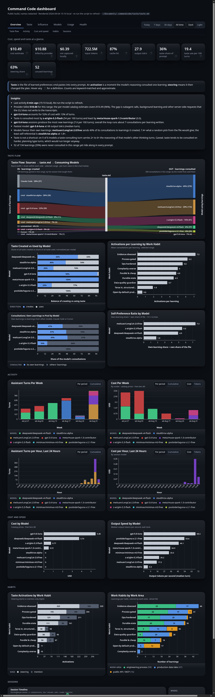
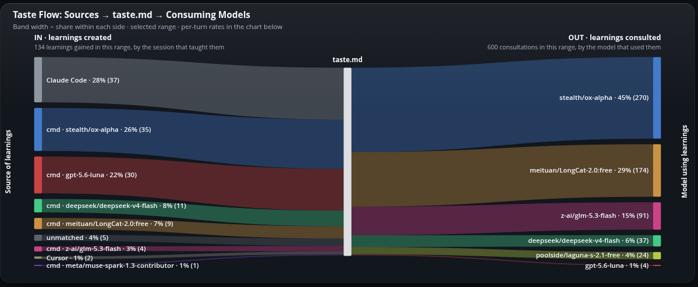
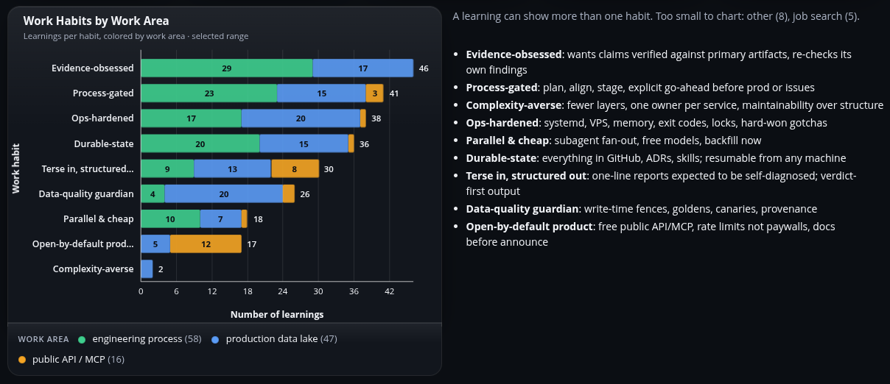
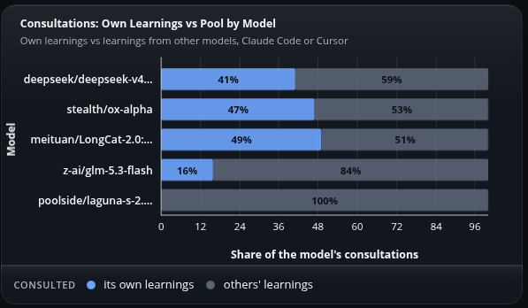

# Command Center dashboard

A single-file HTML dashboard of what your coding CLIs have done on your machine: per-model cost, token usage and speed, sessions, tools and prompts — for [Command Code](https://commandcode.ai), Claude Code, Grok and Devin — plus the Command Code taste file and when taste steers the model.

Python 3.10+, no packages. One optional read-only call to api.commandcode.ai for your billed total (`--offline` to skip).



## Install

As a skill (Claude Code or Command Code):

```bash
git clone https://github.com/Evan-Kim2028/command-center-dashboard-skill ~/.claude/skills/command-center-dashboard
# or
git clone https://github.com/Evan-Kim2028/command-center-dashboard-skill ~/.commandcode/skills/command-center-dashboard
```

Script only:

```bash
curl -fsSL https://raw.githubusercontent.com/Evan-Kim2028/command-center-dashboard-skill/main/scripts/cmd_dashboard.py -o cmd_dashboard.py
curl -fsSL https://raw.githubusercontent.com/Evan-Kim2028/command-center-dashboard-skill/main/scripts/harness_readers.py -o harness_readers.py
```

`harness_readers.py` must sit beside `cmd_dashboard.py`. Without it the dashboard still builds, Command Code only.

## Use

In a cmd or Claude Code session:

```
/command-center-dashboard build the public dashboard and open it
```

Or directly:

```bash
python3 cmd_dashboard.py            # private build, opens in your browser
python3 cmd_dashboard.py --public   # names and paths redacted, safe to share
python3 cmd_dashboard.py --list     # show which cmd projects have sessions
python3 cmd_dashboard.py --harness claude        # Claude Code instead of cmd
python3 cmd_dashboard.py --harness grok --compare none
```

`--harness cmd|claude|grok|devin` picks whose sessions fill Overview / Models / Usage; the Harnesses tab compares them side by side. Costs are list-price estimates — Grok is flat-rate on a subscription and Devin bills in ACUs, so neither figure is what you paid.

Run it from the project you use cmd in. If the current directory has no sessions it picks the project with the most and says so.

## Public builds

Add project-specific names to `~/.commandcode/redact.json`:

```json
[["my-repo-name", "the repo"], ["prod-host-alias", "the prod host"]]
```

Your username and home path are always redacted. Grep the output before sharing.

Full data map, metric definitions and design rules: [SKILL.md](SKILL.md). MIT license.

## Gallery

**Taste flow.** Where learnings come from and which models consult them.



**What taste knows about you** and **how much each model uses it**.

<p> </p>
